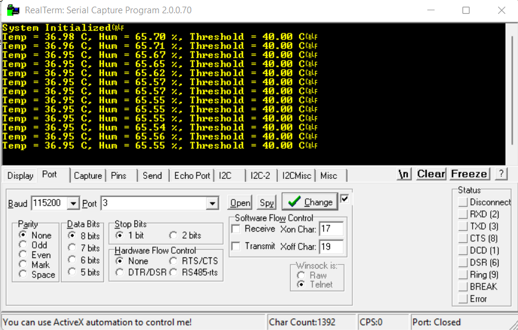
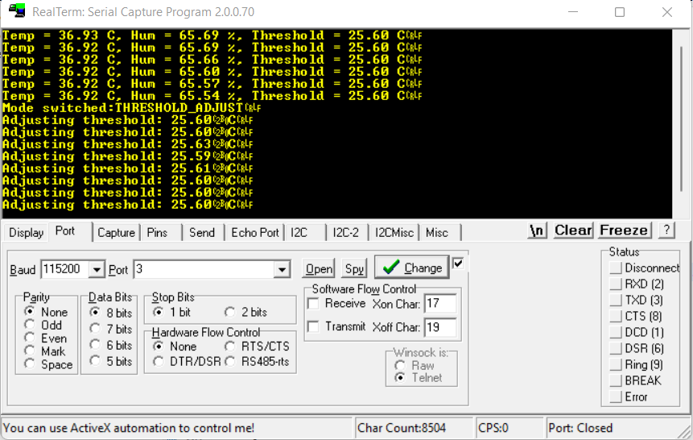

# stm32-freertos-environment-monitor
## Overview
This project implements a **real-time environmental monitoring and control system** on the **STM32F411RE** microcontroller using **FreeRTOS**.  
The system continuously monitors **temperature** and **humidity** using a **BME280 sensor**, provides **visual feedback with an RGB LED**, and allows the user to dynamically adjust the **temperature threshold** using a potentiometer.
The system is designed with **multitasking** using FreeRTOS to handle sensor reading, LED control, and user input concurrently, ensuring responsive real-time operation.

## Features

### Live Streaming Mode
- Reads temperature and humidity from the BME280 sensor via I2C.
- Sends live sensor data to a serial terminal over **USART2**.
- RGB LED indicates temperature status:
  - **Blue:** Temp < 18°C
  - **Green:** Temp within normal range (≤ threshold)
  - **Red:** Temp > threshold

### Threshold Adjustment Mode
- Adjust the temperature threshold dynamically using a **potentiometer (ADC PA0)**.
- Threshold range: **25°C – 45°C**.

### Mode Switching
- Push button (PA1) toggles between Live Streaming and Threshold Adjustment modes.
- **Button debouncing** implemented using **TIM2**.
- **FreeRTOS binary semaphore** used for safe ISR-to-task communication.

### Real-Time Control & Multitasking
- **FreeRTOS tasks** manage sensor reading, LED control, and user input concurrently.
- Efficient handling of interrupts and ADC for responsive system operation.
- Visual feedback and logging operate in real time without blocking each other.

## Hardware & Architecture
- **Microcontroller:** STM32F411RE
- **Core:** ARM Cortex-M4, 32-bit, running at 100 MHz
- **Features used:**
  - I2C for BME280 sensor
  - ADC for potentiometer input
  - TIM2 for button debounce
  - EXTI for push button interrupts
  - USART2 for serial communication
- **FreeRTOS** for multitasking

## Images

**Hardware Setup:**

**Live Output on Serial Monitor:**

**RGB LED Behavior:**

